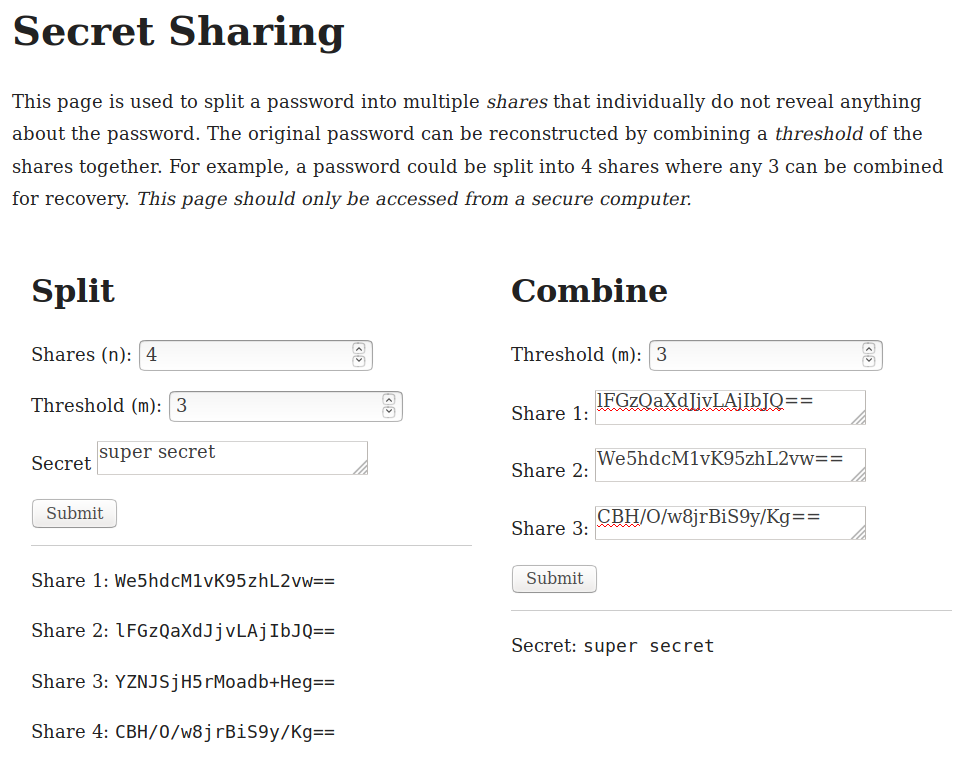

# Secret Sharing

This is a minimal web application used for secret sharing. The page may be used to split a password into multiple *shares* that individually do not reveal anything about the password. The original password can be reconstructed by combining a *threshold* of the shares together. For example, a password could be split into 4 shares where any 3 can be combined for recovery.

*This page should only be accessed from a secure computer.*

## Usage

Open the `index.html` page in a modern browser. Use left form to split secret into multiple shares and right form to recombine shares to recover secret.

## Shamir's

The application implements [Shamir's Secret Sharing](https://en.wikipedia.org/wiki/Shamir%27s_Secret_Sharing) algorithm. The code is a direct port of the [Hashicorp Vault](https://github.com/hashicorp/vault/tree/533003e27840d9646cb4e7d23b3a113895da1dd0/shamir) implementation in Go, except that it makes no attempt to ensure constant time operations.

## Browser Support

The code makes use of ES6 syntax, typed arrays, and other newer JavaScript features.

## License

Copyright 2018 Jim Posen

Permission is hereby granted, free of charge, to any person obtaining a copy of this software and associated documentation files (the "Software"), to deal in the Software without restriction, including without limitation the rights to use, copy, modify, merge, publish, distribute, sublicense, and/or sell copies of the Software, and to permit persons to whom the Software is furnished to do so, subject to the following conditions:

The above copyright notice and this permission notice shall be included in all copies or substantial portions of the Software.

THE SOFTWARE IS PROVIDED "AS IS", WITHOUT WARRANTY OF ANY KIND, EXPRESS OR IMPLIED, INCLUDING BUT NOT LIMITED TO THE WARRANTIES OF MERCHANTABILITY, FITNESS FOR A PARTICULAR PURPOSE AND NONINFRINGEMENT. IN NO EVENT SHALL THE AUTHORS OR COPYRIGHT HOLDERS BE LIABLE FOR ANY CLAIM, DAMAGES OR OTHER LIABILITY, WHETHER IN AN ACTION OF CONTRACT, TORT OR OTHERWISE, ARISING FROM, OUT OF OR IN CONNECTION WITH THE SOFTWARE OR THE USE OR OTHER DEALINGS IN THE SOFTWARE.